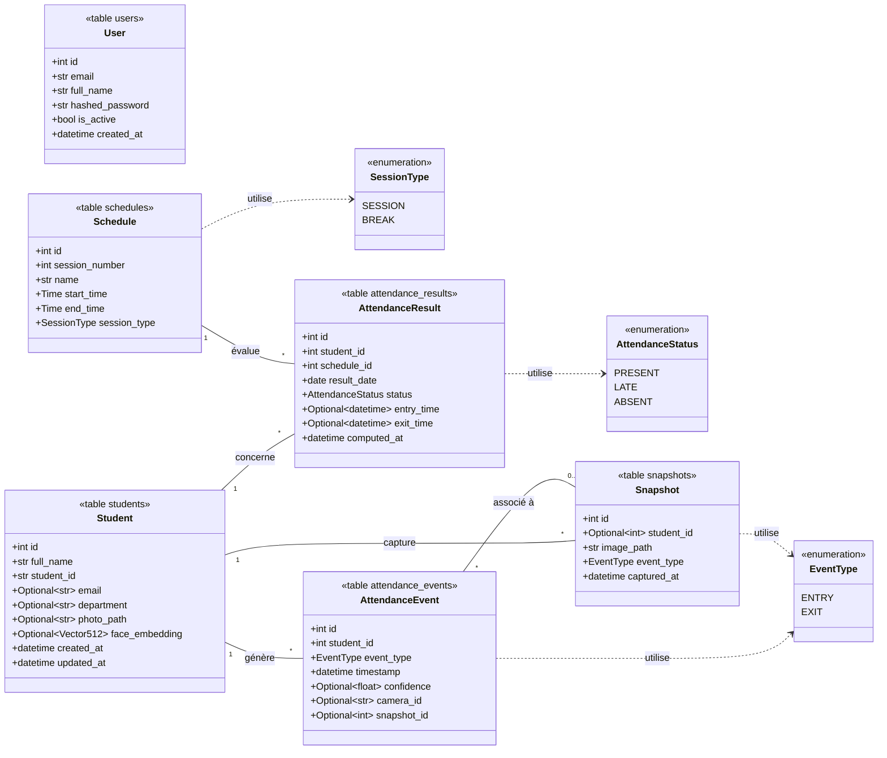
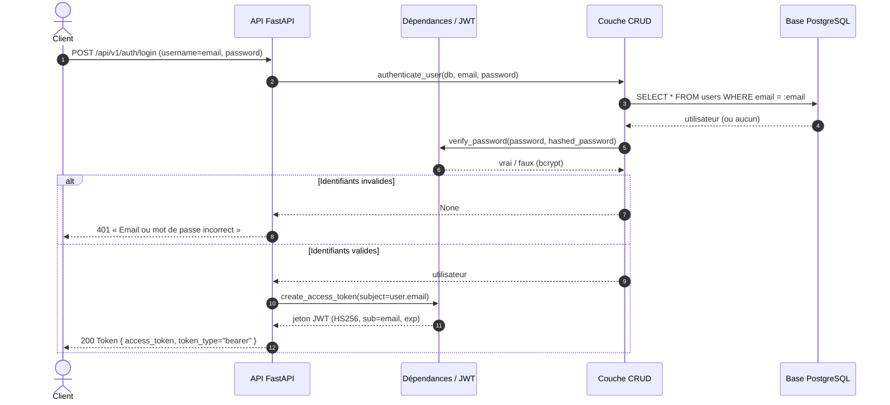
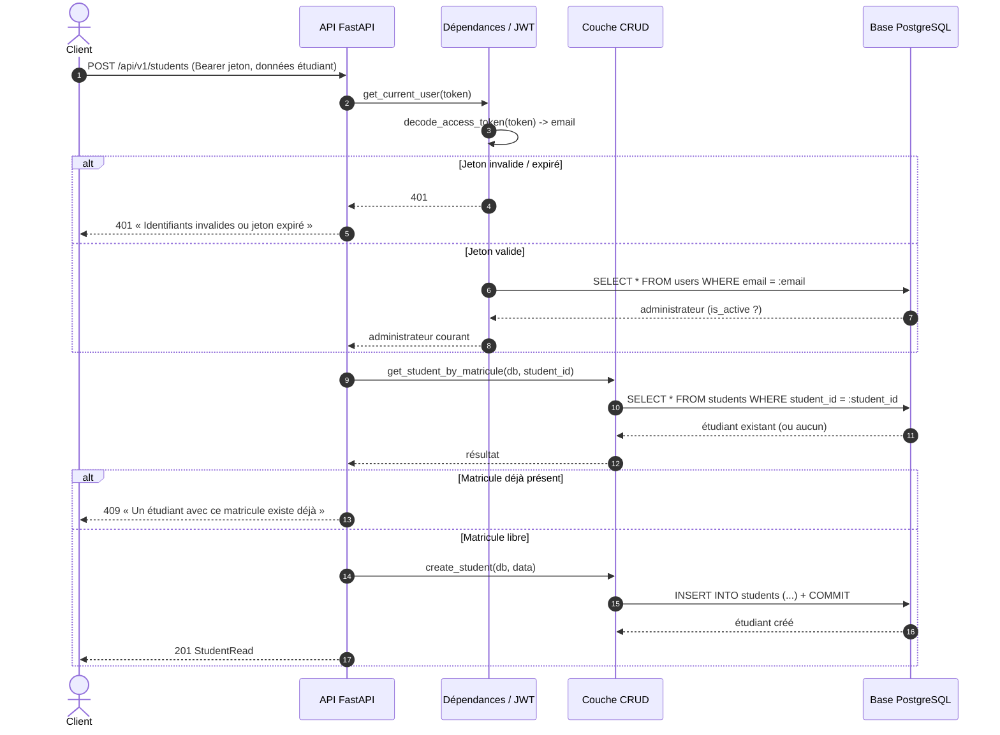

# Backend — Système de présence intelligent (Phase 1)

Squelette du backend : **FastAPI + SQLAlchemy + Alembic**, authentification
**JWT** et gestion complète des étudiants (**CRUD + recherche**). Architecture
en couches (modèles / schémas / CRUD / routes), prête à accueillir les modules
des phases suivantes (reconnaissance faciale, caméra, calcul de présence,
rapports).

## Ce qui fonctionne dans cette phase

- Connexion administrateur et jeton JWT (`/api/v1/auth/login`)
- CRUD étudiants + recherche par nom / matricule / département
- Six tables créées : `users`, `students`, `schedules`, `attendance_events`,
  `attendance_results`, `snapshots`
- Colonne `face_embedding` (pgvector, 512 dim.) déjà prévue mais non utilisée
- Emploi du temps des 5 séances inséré automatiquement

## Prérequis

- Python 3.11+
- Docker (pour PostgreSQL avec pgvector)

## Installation~

```bash
# 1) Environnement virtuel
python -m venv .venv
source .venv/bin/activate          # sous fish : source .venv/bin/activate.fish

# 2) Dépendances
pip install -r requirements.txt

# 3) Variables d'environnement
cp .env.example .env

# 4) Base de données (PostgreSQL + pgvector)
docker compose up -d
```

## Migrations et données initiales

```bash
# Génère la première migration à partir des modèles
alembic revision --autogenerate -m "init schema"

# Applique les migrations
alembic upgrade head

# Crée l'admin par défaut et l'emploi du temps
python -m app.initial_data
```

## Lancer l'API

```bash
uvicorn app.main:app --reload
```

- Documentation interactive (Swagger) : http://localhost:8000/docs
- Test de santé : http://localhost:8000/health

## Compte administrateur par défaut

| Email             | Mot de passe |
|-------------------|--------------|
| admin@univ.local  | admin123     |

> À changer immédiatement. Pour tester dans Swagger : bouton **Authorize**,
> saisir l'email dans le champ `username` et le mot de passe.

## Diagrammes UML

Diagrammes fidèles au code de la phase 1 (les versions détaillées sont dans
`../docs/diagrams/`).

### Diagramme de classes



### Diagramme de séquence — Authentification (connexion administrateur)



### Diagramme de séquence — Création d'un étudiant (route protégée)



## Structure du projet

```
app/
  config.py            Configuration (env, JWT, pgvector)
  database.py          Moteur et session SQLAlchemy
  main.py              Point d'entrée FastAPI
  initial_data.py      Admin par défaut + emploi du temps
  core/
    security.py        Hachage bcrypt + jetons JWT
    deps.py            Dépendances (session, utilisateur courant)
  models/              Tables ORM (6 modèles + énumérations)
  schemas/             Schémas Pydantic (validation API)
  crud/                Accès aux données (users, students)
  api/routes/          Routes (auth, students)
  services/            (vide) — logique métier des phases suivantes
alembic/               Migrations
docker-compose.yml     PostgreSQL + pgvector
```

## Prochaines étapes (feuille de route)

- **Phase 2** : enrôlement facial hors-ligne (InsightFace → embedding → pgvector)
- **Phase 3** : pipeline caméra (RetinaFace + ByteTrack + InsightFace)
- **Phase 4** : logique entrée/sortie (ligne de franchissement) + événements
- **Phase 5** : anti-spoofing (MiniFASNet)
- **Phase 6** : moteur de calcul de présence par séance
- **Phase 7** : frontend React
- **Phase 8** : rapports (PDF / Excel / CSV)
