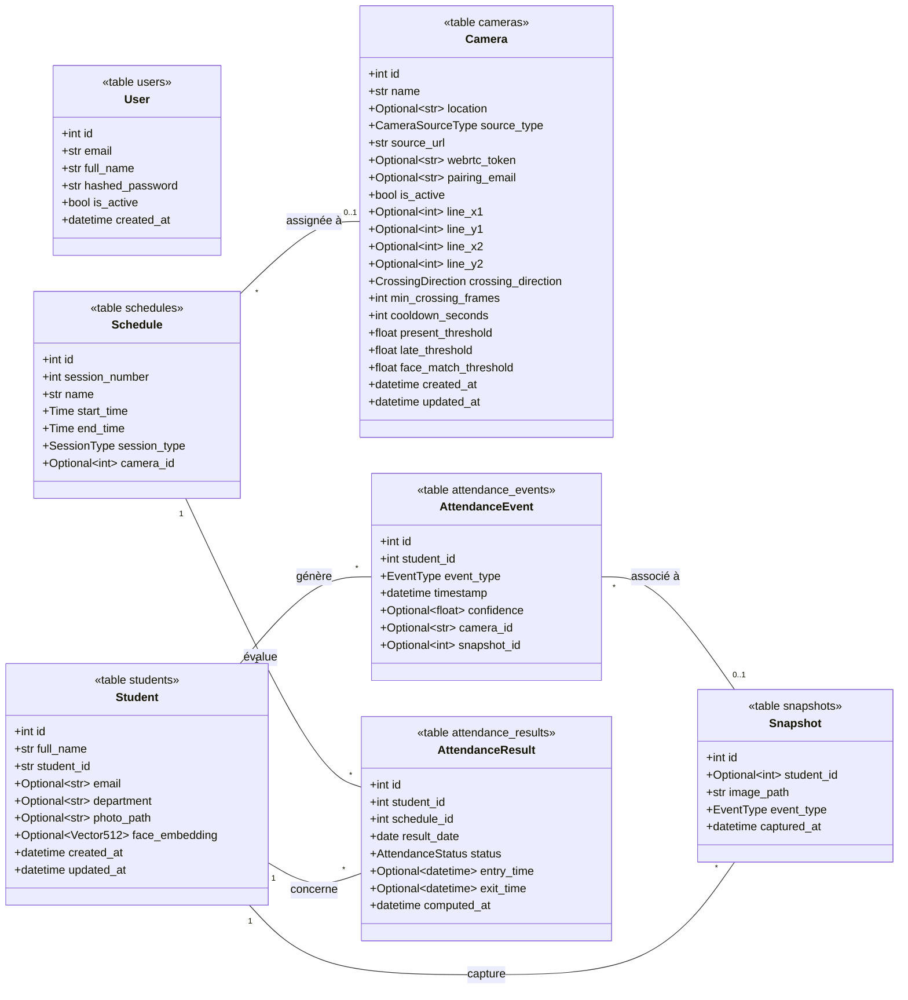

# Diagramme de classes (UML) — Modèles ORM

Seules les 7 tables de la base de données sont représentées. Fidèle au code réel :
`backend/app/models/*`.

> `Optional~type~` représente les types optionnels (`str | None`, etc.) du code.
> `Vector512` = `Vector(512)` (pgvector). Les énumérations
> (`EventType`, `SessionType`, `AttendanceStatus`, `CrossingDirection`,
> `CameraSourceType`) sont stockées en base comme `Enum` PostgreSQL.
