# Diagramme de classes (UML)

Diagramme fidèle au code réel : modèles ORM (`backend/app/models/*`), énumérations
(`app/models/enums.py`), schémas Pydantic (`app/schemas/*`), couche CRUD
(`app/crud/*`) et services métier (`app/services/*`). Chaque attribut / signature a
été vérifié par rapport à son fichier source. Visibilité `+` = public.

Les classes marquées `<<future>>` correspondent au **service IA non implémenté**
(caméra unique + ligne de franchissement) décrit dans
`app/services/ai/README.md`.

```mermaid
classDiagram
    direction LR

    %% ======================= Énumérations =======================
    class EventType {
        <<enumeration>>
        ENTRY
        EXIT
    }
    class SessionType {
        <<enumeration>>
        SESSION
        BREAK
    }
    class AttendanceStatus {
        <<enumeration>>
        PRESENT
        LATE
        ABSENT
    }
    class ReportPeriod {
        <<enumeration>>
        DAILY
        WEEKLY
        MONTHLY
    }

    %% ======================= Modèles ORM =======================
    class User {
        <<table users>>
        +int id
        +str email
        +str full_name
        +str hashed_password
        +bool is_active
        +datetime created_at
    }
    class Student {
        <<table students>>
        +int id
        +str full_name
        +str student_id
        +Optional~str~ email
        +Optional~str~ department
        +Optional~str~ photo_path
        +Optional~Vector512~ face_embedding
        +datetime created_at
        +datetime updated_at
    }
    class Schedule {
        <<table schedules>>
        +int id
        +int session_number
        +str name
        +Time start_time
        +Time end_time
        +SessionType session_type
    }
    class AttendanceEvent {
        <<table attendance_events>>
        +int id
        +int student_id
        +EventType event_type
        +datetime timestamp
        +Optional~float~ confidence
        +Optional~str~ camera_id
        +Optional~int~ snapshot_id
    }
    class AttendanceResult {
        <<table attendance_results>>
        +int id
        +int student_id
        +int schedule_id
        +date result_date
        +AttendanceStatus status
        +Optional~datetime~ entry_time
        +Optional~datetime~ exit_time
        +datetime computed_at
        +uq_presence_unique(student_id, schedule_id, result_date)
    }
    class Snapshot {
        <<table snapshots>>
        +int id
        +Optional~int~ student_id
        +str image_path
        +EventType event_type
        +datetime captured_at
    }

    %% ======================= Schémas Pydantic =======================
    class UserCreate {
        <<schema>>
        +EmailStr email
        +str full_name
        +str password
    }
    class UserRead {
        <<schema>>
        +int id
        +EmailStr email
        +str full_name
        +bool is_active
        +datetime created_at
    }
    class Token {
        <<schema>>
        +str access_token
        +str token_type
    }
    class StudentCreate {
        <<schema>>
        +str full_name
        +str student_id
        +Optional~EmailStr~ email
        +Optional~str~ department
    }
    class StudentUpdate {
        <<schema>>
        +Optional~str~ full_name
        +Optional~str~ student_id
        +Optional~EmailStr~ email
        +Optional~str~ department
    }
    class StudentRead {
        <<schema>>
        +int id
        +str full_name
        +str student_id
        +Optional~EmailStr~ email
        +Optional~str~ department
        +Optional~str~ photo_path
        +bool has_face_embedding
        +datetime created_at
        +datetime updated_at
    }
    class ScheduleRead {
        <<schema>>
        +int id
        +int session_number
        +str name
        +Time start_time
        +Time end_time
        +SessionType session_type
    }
    class AttendanceEventCreate {
        <<schema>>
        +int student_id
        +EventType event_type
        +Optional~datetime~ timestamp
        +Optional~float~ confidence
        +Optional~str~ camera_id
    }
    class AttendanceEventRead {
        <<schema>>
        +int id
        +int student_id
        +EventType event_type
        +datetime timestamp
        +Optional~float~ confidence
        +Optional~str~ camera_id
        +Optional~int~ snapshot_id
    }
    class AttendanceResultRead {
        <<schema>>
        +int id
        +int student_id
        +int schedule_id
        +date result_date
        +AttendanceStatus status
        +Optional~datetime~ entry_time
        +Optional~datetime~ exit_time
        +datetime computed_at
    }
    class ComputeReportRead {
        <<schema>>
        +date result_date
        +int students_processed
        +int sessions_per_student
        +int results_written
    }
    class RecentEvent {
        <<schema>>
        +int id
        +int student_id
        +str student_name
        +EventType event_type
        +datetime timestamp
    }
    class DashboardSummary {
        <<schema>>
        +date date
        +int total_students
        +int present_today
        +int absent_today
        +list~RecentEvent~ recent_events
    }

    %% ======================= Couche CRUD =======================
    class CRUD_User {
        <<crud user>>
        +get_user_by_email(db, email) User
        +create_user(db, data) User
        +authenticate_user(db, email, password) User
    }
    class CRUD_Student {
        <<crud student>>
        +get_student(db, pk) Student
        +get_student_by_matricule(db, student_id) Student
        +list_students(db, skip, limit, search) list~Student~
        +create_student(db, data) Student
        +update_student(db, student, data) Student
        +delete_student(db, student) None
    }
    class CRUD_Schedule {
        <<crud schedule>>
        +list_schedules(db) list~Schedule~
        +get_schedule(db, schedule_pk) Schedule
    }
    class CRUD_AttendanceEvent {
        <<crud attendance_event>>
        +create_event(db, data) AttendanceEvent
        +list_events(db, student_id, on_date, skip, limit) list~AttendanceEvent~
        +get_events_for_student_on_date(db, student_id, on_date) list~AttendanceEvent~
        +distinct_student_ids_with_events_on_date(db, on_date) list~int~
    }
    class CRUD_AttendanceResult {
        <<crud attendance_result>>
        +upsert_result(db, student_id, schedule_id, result_date, status, entry_time, exit_time) AttendanceResult
        +list_results(db, student_id, on_date, schedule_id, skip, limit) list~AttendanceResult~
    }
    class CRUD_Dashboard {
        <<crud dashboard>>
        +count_students(db) int
        +count_present_students(db, on_date) int
        +recent_events(db, limit) list
    }

    %% ======================= Services métier =======================
    class Interval {
        <<service attendance>>
        +datetime start
        +Optional~datetime~ end
    }
    class SessionComputation {
        <<service attendance>>
        +AttendanceStatus status
        +float overlap_ratio
        +float overlap_seconds
        +Optional~datetime~ entry_time
        +Optional~datetime~ exit_time
    }
    class ComputeReport {
        <<service attendance>>
        +date result_date
        +int students_processed
        +int sessions_per_student
        +int results_written
    }
    class AttendanceEngine {
        <<service attendance>>
        +build_intervals(events) list~Interval~
        +compute_session(intervals, window_start, window_end, present_threshold, late_threshold) SessionComputation
        +compute_student_date(db, student_id, on_date) int
        +compute_date(db, on_date, student_id) ComputeReport
    }
    class StudentReportRow {
        <<service reports>>
        +int student_id
        +str student_name
        +str matricule
        +int present
        +int late
        +int absent
        +int total
        +float attendance_rate
    }
    class Report {
        <<service reports>>
        +ReportPeriod period
        +date start_date
        +date end_date
        +list~StudentReportRow~ rows
        +str title
    }
    class ReportsService {
        <<service reports>>
        +period_range(period, reference) tuple
        +build_report(db, period, reference) Report
        +to_csv(report) bytes
        +to_excel(report) bytes
        +to_pdf(report) bytes
    }

    %% ============ Service IA prévu (caméra unique) — non implémenté ============
    class FaceDetector {
        <<future>>
        +detect(frame) list~FaceBox~
    }
    class Tracker {
        <<future>>
        +update(detections) list~Track~
    }
    class SpoofDetector {
        <<future>>
        +is_live(face_image) bool
    }
    class FaceRecognizer {
        <<future>>
        +embed(face_image) list~float~
        +identify(embedding) StudentMatch
    }
    class LineCrossingDirection {
        <<future>>
        +update(track_id, center_xy, at) AttendanceEvent
    }

    %% ======================= Relations entre entités =======================
    Student "1" -- "*" AttendanceEvent : génère
    Student "1" -- "*" AttendanceResult : concerne
    Schedule "1" -- "*" AttendanceResult : évalue
    Student "1" -- "*" Snapshot : capture
    AttendanceEvent "*" -- "0..1" Snapshot : associé à

    %% ======================= Dépendances aux énumérations =======================
    Schedule ..> SessionType : utilise
    AttendanceEvent ..> EventType : utilise
    AttendanceResult ..> AttendanceStatus : utilise
    Snapshot ..> EventType : utilise
    Report ..> ReportPeriod : utilise

    %% ======================= Schémas / CRUD -> modèles =======================
    UserCreate ..> User : crée
    UserRead ..> User : projette
    StudentCreate ..> Student : crée
    StudentUpdate ..> Student : met à jour
    StudentRead ..> Student : projette
    ScheduleRead ..> Schedule : projette
    AttendanceEventCreate ..> AttendanceEvent : crée
    AttendanceEventRead ..> AttendanceEvent : projette
    AttendanceResultRead ..> AttendanceResult : projette
    CRUD_User ..> User : gère
    CRUD_User ..> Token : émet (via JWT)
    CRUD_Student ..> Student : gère
    CRUD_Schedule ..> Schedule : gère
    CRUD_AttendanceEvent ..> AttendanceEvent : gère
    CRUD_AttendanceResult ..> AttendanceResult : gère
    CRUD_Dashboard ..> DashboardSummary : alimente

    %% ======================= Dépendances des services =======================
    AttendanceEngine ..> Interval : construit
    AttendanceEngine ..> SessionComputation : produit
    AttendanceEngine ..> ComputeReport : produit
    AttendanceEngine ..> CRUD_AttendanceEvent : lit
    AttendanceEngine ..> CRUD_AttendanceResult : écrit
    AttendanceEngine ..> CRUD_Schedule : lit
    ReportsService ..> Report : produit
    Report ..> StudentReportRow : contient

    %% ============ Chaîne du service IA prévu (producteur d'événements) ============
    FaceDetector ..> Tracker : alimente
    Tracker ..> SpoofDetector : alimente
    SpoofDetector ..> FaceRecognizer : alimente
    FaceRecognizer ..> LineCrossingDirection : alimente
    LineCrossingDirection ..> AttendanceEvent : émet
```

> **Notes de fidélité**
> - `Optional~type~` représente les types optionnels (`str | None`, etc.) du code ;
>   `Vector512` correspond à `Vector(512)` (pgvector).
> - `AttendanceEngine` et `ReportsService` regroupent, pour la lisibilité, des
>   **fonctions de module** (pas des classes réelles) définies dans
>   `app/services/attendance/*` et `app/services/reports/*`.
> - Les tables `attendance_events`, `attendance_results` et `snapshots` disposent
>   désormais d'une couche CRUD/schéma (sauf `Snapshot`, écrit par le futur
>   service IA). `User` et `Student` conservent leur CRUD complet.
> - Les classes `<<future>>` décrivent le **service IA caméra unique** (ligne de
>   franchissement) prévu mais **non implémenté** ; il n'y a plus de composant de
>   corrélation multi-caméras.
