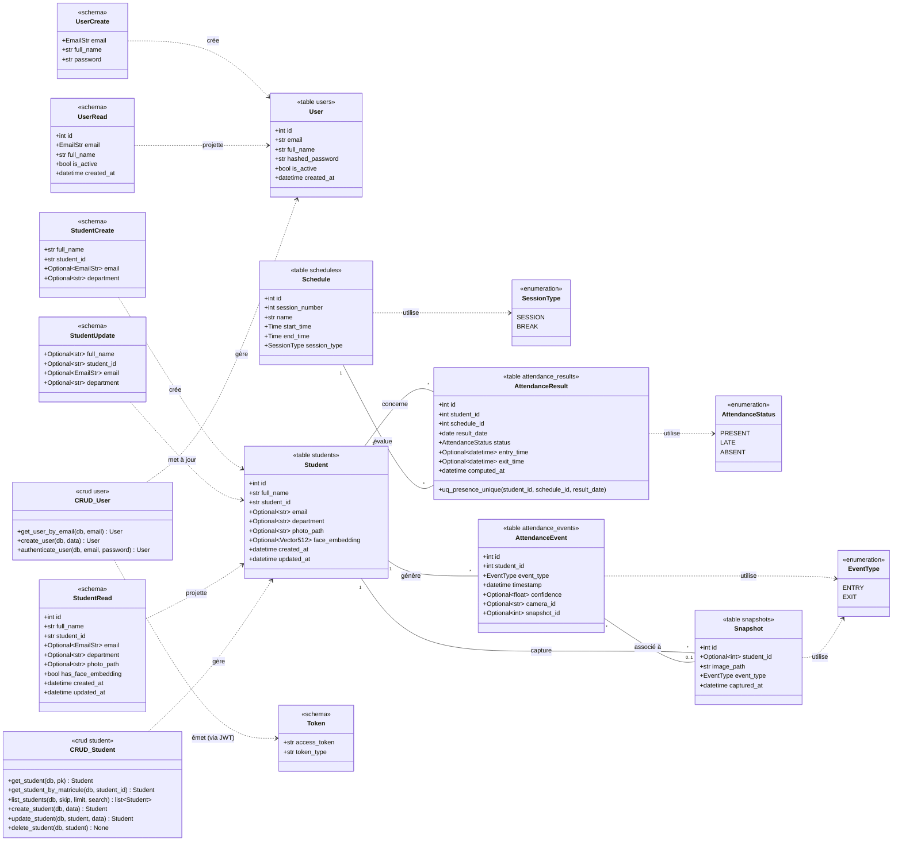

# Diagramme de classes (UML)

Diagramme fidèle au code des modèles ORM (`backend/app/models/*`), des énumérations
(`app/models/enums.py`) et des principaux schémas Pydantic (`app/schemas/*`).
Chaque attribut a été vérifié par rapport à son fichier source. Visibilité `+` = public.

> Note de fidélité : `Optional~type~` représente les types optionnels
> (`str | None`, etc.) du code ; `Vector512` correspond à `Vector(512)` (pgvector).
> Les tables `attendance_events`, `attendance_results` et `snapshots` n'ont
> **pas encore** de couche CRUD/schéma associée dans le code (phases futures).
