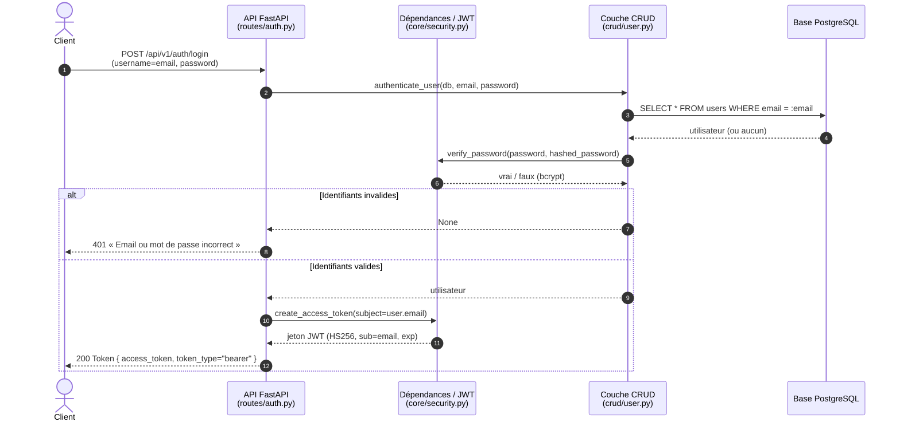
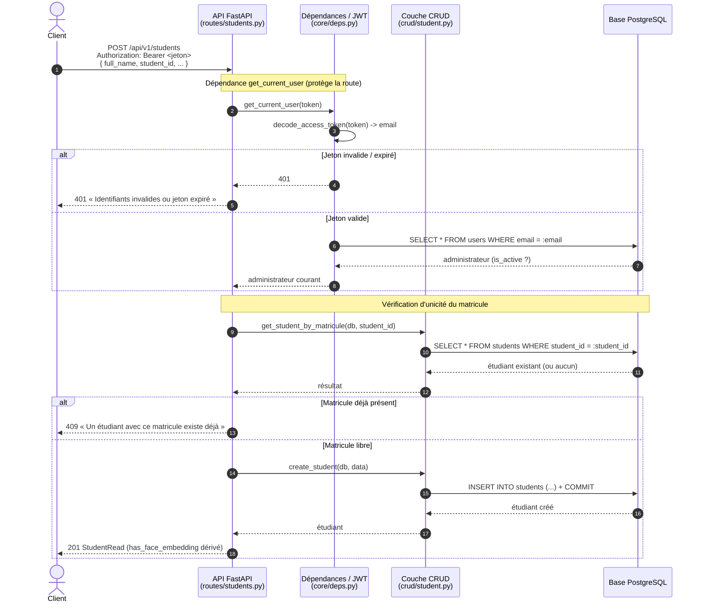
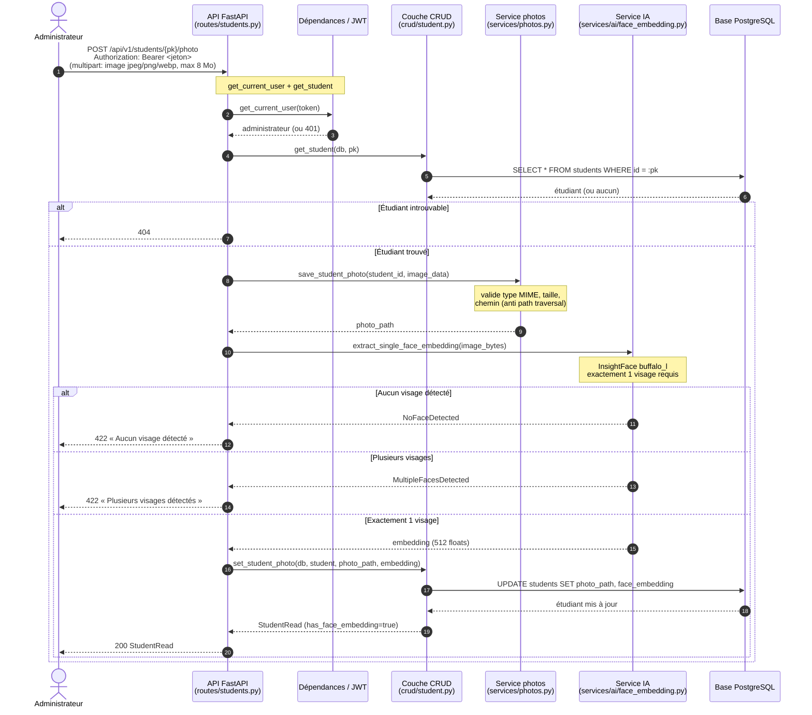
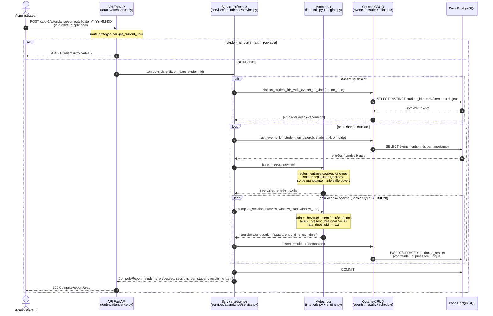
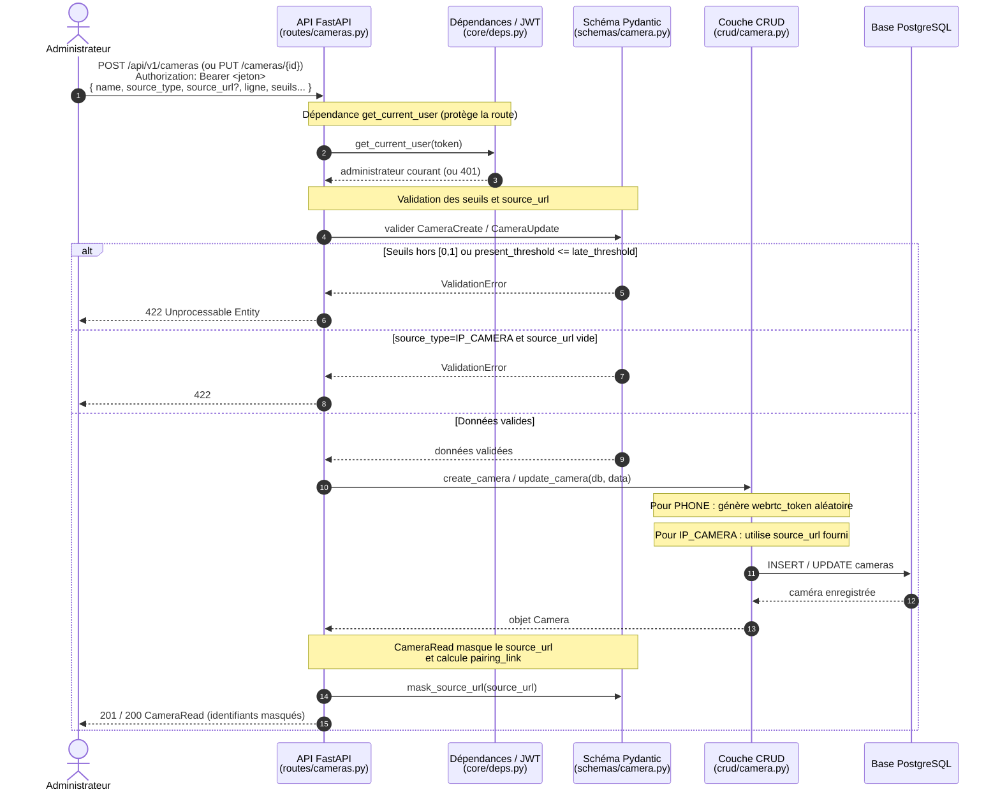
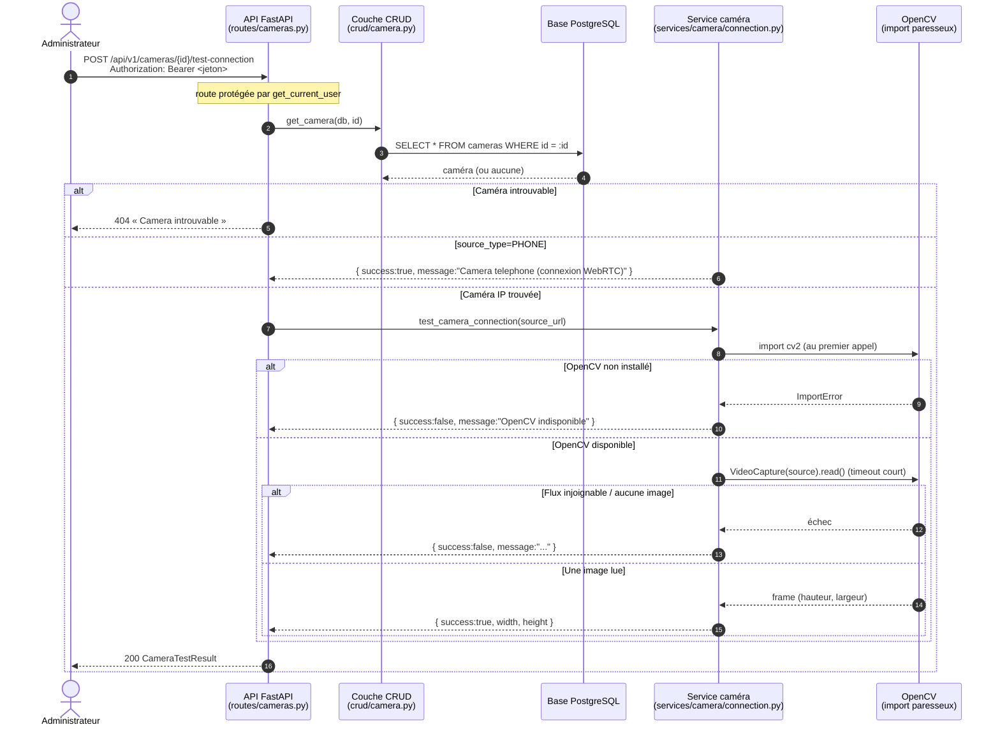
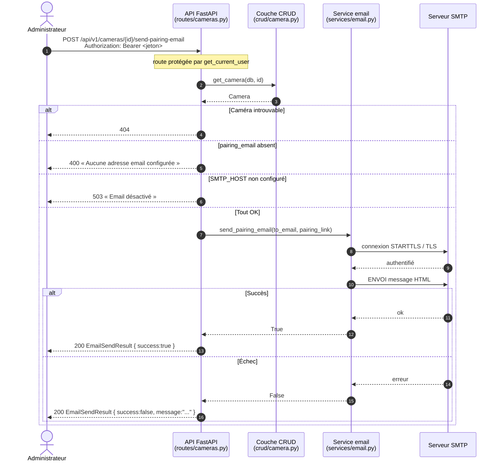
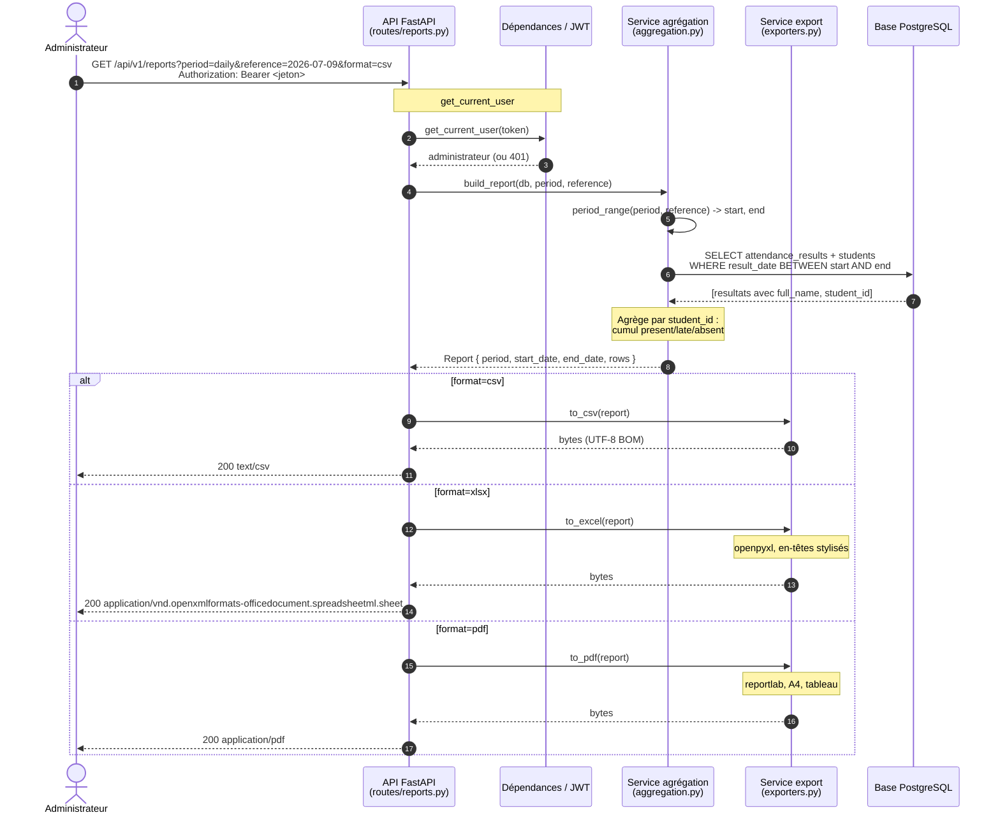
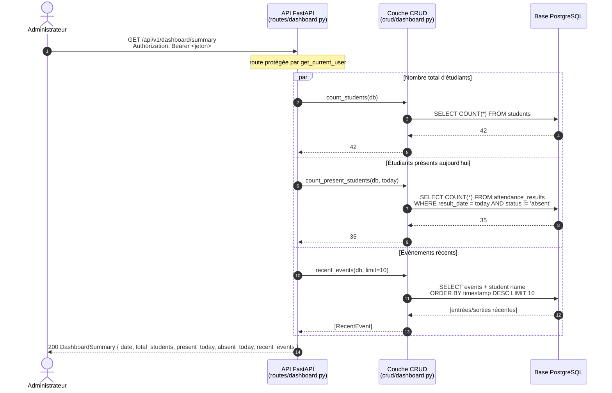

# Diagrammes de séquence (UML)

Participants réels du code : **Client**, **API FastAPI**, **Dépendances/JWT**
(`core/deps.py` + `core/security.py`), **Couche CRUD** (`crud/*`),
**Services** (`services/*`), **Base PostgreSQL**, **InsightFace**,
**aiortc/WebRTC**.

---

## 1. Authentification (connexion administrateur) — *implémenté*

Source : `app/api/routes/auth.py`, `app/crud/user.py`, `app/core/security.py`.



---

## 2. Création d'un étudiant (requête protégée) — *implémenté*

Source : `app/api/routes/students.py`, `app/core/deps.py`, `app/crud/student.py`.



---

## 3. Enrôlement facial (upload photo + embedding) — *implémenté*

Source : `app/api/routes/students.py` (`POST /{pk}/photo`), `app/services/photos.py`,
`app/services/ai/face_embedding.py`, `app/crud/student.py`.



---

## 4. Calcul de présence — *implémenté*

Source : `app/api/routes/attendance.py`, `app/services/attendance/*`,
`app/crud/attendance_event.py`, `app/crud/attendance_result.py`,
`app/crud/schedule.py`.



---

## 5. Flux caméra téléphone (WebRTC + reconnaissance en direct) — *implémenté*

Source : `app/api/routes/phone_camera.py`, `app/services/camera/webrtc.py`,
`app/services/attendance/live_recognition.py`, `app/services/ai/face_embedding.py`.

```mermaid
sequenceDiagram
    autonumber
    participant Phone as Téléphone<br/>(navigateur)
    participant Pub as API publique<br/>(routes/phone_camera.py)
    participant WebRTC as Service WebRTC<br/>(services/camera/webrtc.py)
    participant CRUD as Couche CRUD
    participant DB as Base PostgreSQL
    participant Admin as Administrateur<br/>(frontend)
    participant Live as Boucle Live<br/>(live_recognition.py)
    participant Face as IA faciale<br/>(face_embedding.py)

    Note over Admin,DB: 0. Admin crée une caméra PHONE
    Admin->>Admin: POST /api/v1/cameras { source_type: "phone", name: "Salle A" }
    Note over Admin,CRUD: Le CRUD génère un webrtc_token aléatoire
    Admin-->>Admin: CameraRead { webrtc_token, pairing_link }

    Note over Admin,Phone: 1. Admin envoie le lien au téléphone<br/>(par email ou copié manuellement)

    Phone->>Pub: GET /api/v1/phone-camera/{token}
    Pub->>CRUD: get_camera_by_token(token)
    CRUD-->>Pub: Camera info
    Pub-->>Phone: PhoneCameraInfo { name, location, is_active }

    Note over Phone: Affiche la page d'appairage<br/>Demande accès caméra (getUserMedia)

    Phone->>Phone: getUserMedia({ video: { facingMode: "environment" } })
    alt Permission refusée
        Phone-->>Phone: message d'erreur
    else Flux obtenu
        Phone->>Pub: POST /phone-camera/{token}/offer<br/>{ sdp: offer_SDP, type: "offer" }
        Pub->>WebRTC: handle_offer(token, sdp, type)
        Note over WebRTC: Crée RTCPeerConnection,<br/>attache le track handler,<br/>génère la réponse SDP
        WebRTC-->>Pub: answer_SDP
        Pub-->>Phone: WebRTCAnswer { sdp: answer_SDP, type: "answer" }

        Note over Phone,WebRTC: Connexion WebRTC établie via STUN<br/>Le téléphone diffuse en direct

        loop Toutes les 3 secondes
            Live->>Live: _tick()
            Live->>CRUD: list_cameras(db, limit=500)
            CRUD-->>Live: [caméras actives]

            loop pour chaque caméra PHONE active
                Live->>Live: _active_session(db, camera_id, now)
                Live->>CRUD: list_schedules(db)
                CRUD-->>Live: séances

                alt Séance en cours assignée à cette caméra
                    Live->>WebRTC: get_latest_frame_bgr(token)
                    WebRTC-->>Live: frame BGR (numpy) ou None

                    alt Frame reçue
                        Live->>Face: extract_all_face_embeddings(frame)
                        Face-->>Live: [embeddings + bboxes]

                        Live->>CRUD: list_face_candidates(db)
                        CRUD-->>Live: [(student_id, embedding)]

                        loop pour chaque visage détecté
                            Live->>Face: match_student(embedding, candidates, threshold)
                            Face-->>Live: (student_id, score) ou None

                            alt Match trouvé et pas déjà marqué aujourd'hui
                                Live->>CRUD: create_event(AttendanceEventCreate(
                                    student_id, ENTRY, confidence, camera_id))
                                CRUD->>DB: INSERT INTO attendance_events
                                Live->>Live: _marked_today[student_id] = today
                                Live->>Live: compute_student_date(db, student_id, today)
                                Live->>DB: COMMIT
                            end
                        end
                    end
                end
            end
        end

        Note over Phone: L'utilisateur appuie sur « Arrêter »
        Phone->>Pub: POST /phone-camera/{token}/stop
        Pub->>WebRTC: close_session(token)
        WebRTC-->>Pub: session fermée
        Pub-->>Phone: 204 No Content
    end
```

---

## 6. Configuration d'une caméra par l'administrateur — *implémenté*

Source : `app/api/routes/cameras.py`, `app/schemas/camera.py`, `app/crud/camera.py`.



---

## 7. Test de connexion à une caméra — *implémenté*

Source : `app/api/routes/cameras.py`, `app/services/camera/connection.py`.



---

## 8. Envoi du lien d'appairage par email — *implémenté*

Source : `app/api/routes/cameras.py`, `app/services/email.py`.



---

## 9. Génération de rapport — *implémenté*

Source : `app/api/routes/reports.py`, `app/services/reports/aggregation.py`,
`app/services/reports/exporters.py`.



---

## 10. Tableau de bord — *implémenté*

Source : `app/api/routes/dashboard.py`, `app/crud/dashboard.py`.


