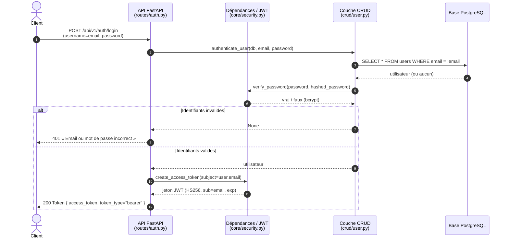
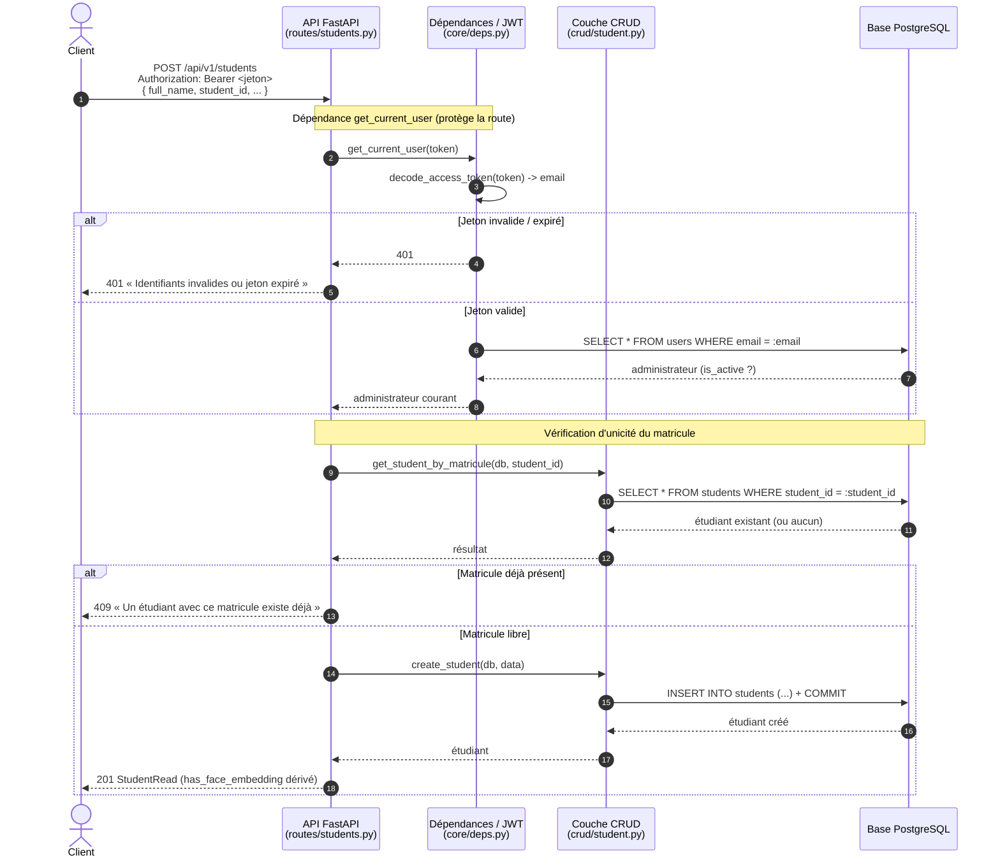
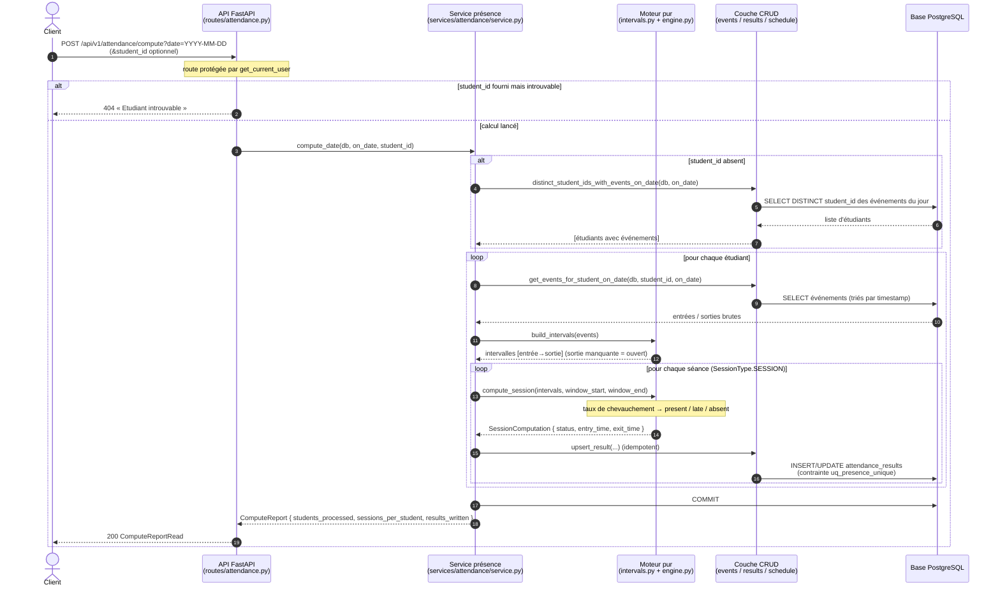
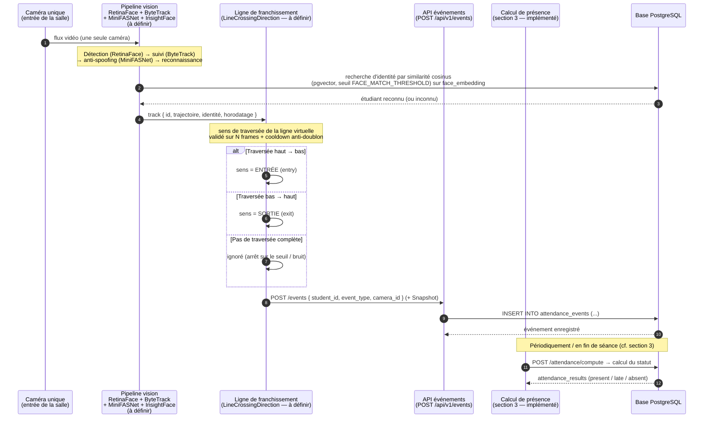

# Diagrammes de séquence (UML)

Participants réels du code : **Client**, **API FastAPI**, **Dépendances/JWT**
(`core/deps.py` + `core/security.py`), **Couche CRUD** (`crud/*`),
**Base PostgreSQL**.

---

## 1. Authentification (connexion administrateur) — *implémenté*

Source : `app/api/routes/auth.py`, `app/crud/user.py`, `app/core/security.py`.

---

## 2. Création d'un étudiant (requête protégée) — *implémenté*

Source : `app/api/routes/students.py`, `app/core/deps.py`, `app/crud/student.py`.

---

## 3. Calcul de présence — *implémenté*

Source : `app/api/routes/attendance.py`, `app/services/attendance/*`,
`app/crud/attendance_event.py`, `app/crud/attendance_result.py`,
`app/crud/schedule.py`.

---

## 4. Flux caméra (une caméra + ligne de franchissement) — *(cible / phase future — NON IMPLÉMENTÉ)*

> ⚠️ **Ce flux n'existe pas encore dans le code.** Le service IA est un simple
> **producteur d'événements** : il écrit les mêmes `attendance_events` que la
> saisie manuelle (`POST /api/v1/events`), puis le calcul de présence (section 3,
> déjà implémenté) s'applique sans changement. Diagramme reconstitué à partir de
> `app/services/ai/README.md` et de
> `docs/detection_entree_sortie_camera_unique.md`.

