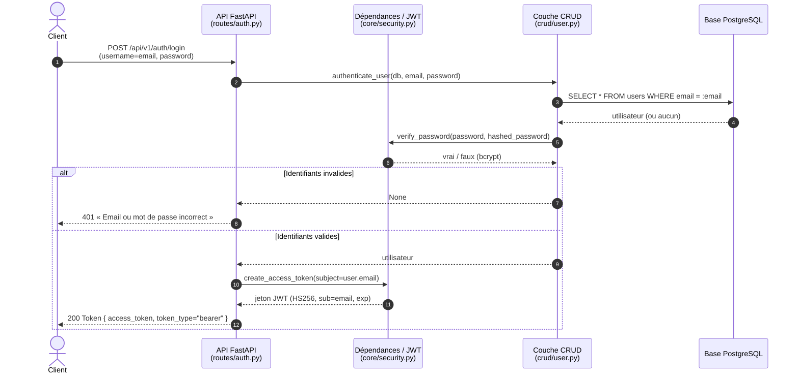
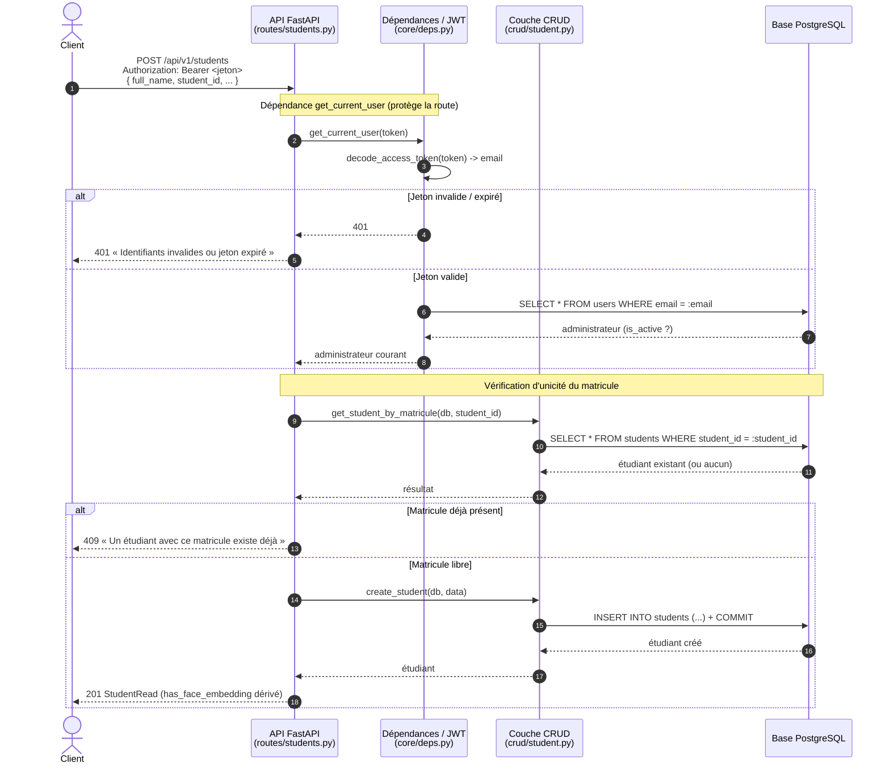
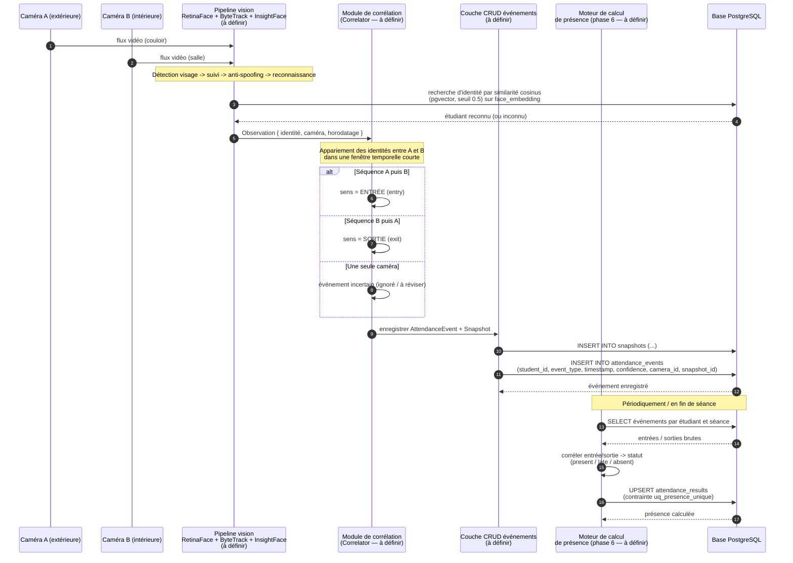

# Diagrammes de séquence (UML)

Participants réels du code : **Client**, **API FastAPI**, **Dépendances/JWT**
(`core/deps.py` + `core/security.py`), **Couche CRUD** (`crud/*`),
**Base PostgreSQL**.

---

## 1. Authentification (connexion administrateur) — *implémenté*

Source : `app/api/routes/auth.py`, `app/crud/user.py`, `app/core/security.py`.

---

## 2. Création d'un étudiant (requête protégée) — *implémenté*

Source : `app/api/routes/students.py`, `app/core/deps.py`, `app/crud/student.py`.

---

## 3. Reconnaissance et calcul de présence — *(cible / phase future — NON IMPLÉMENTÉ)*

> ⚠️ **Ce flux n'existe pas encore dans le code.** Aucun module `services/`,
> aucune route caméra/présence, aucune écriture dans `attendance_events` /
> `attendance_results`. Diagramme reconstitué à partir de la feuille de route
> (`backend/README.md`) et de la note d'architecture
> (`detection_entree_sortie_deux_cameras.md`). Les composants marqués
> *à définir* restent à concevoir.

