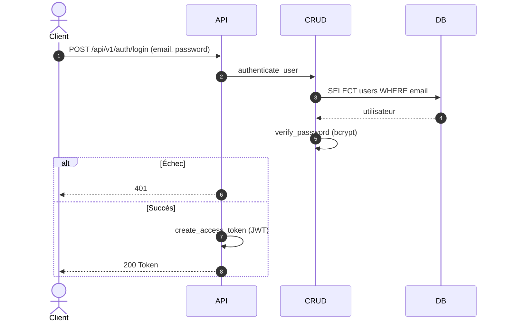
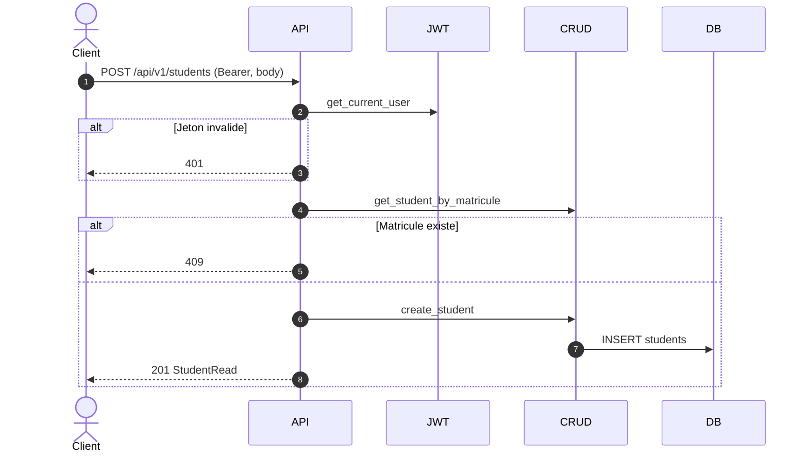
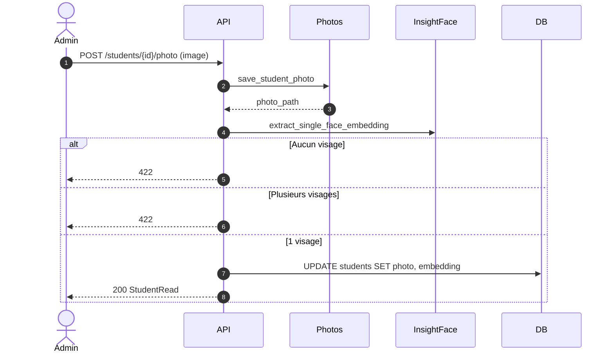
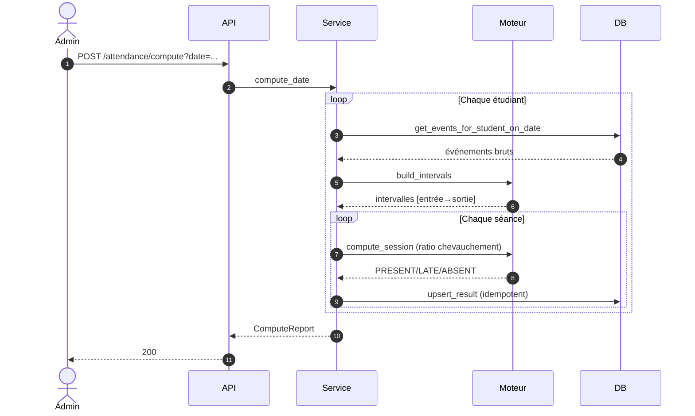
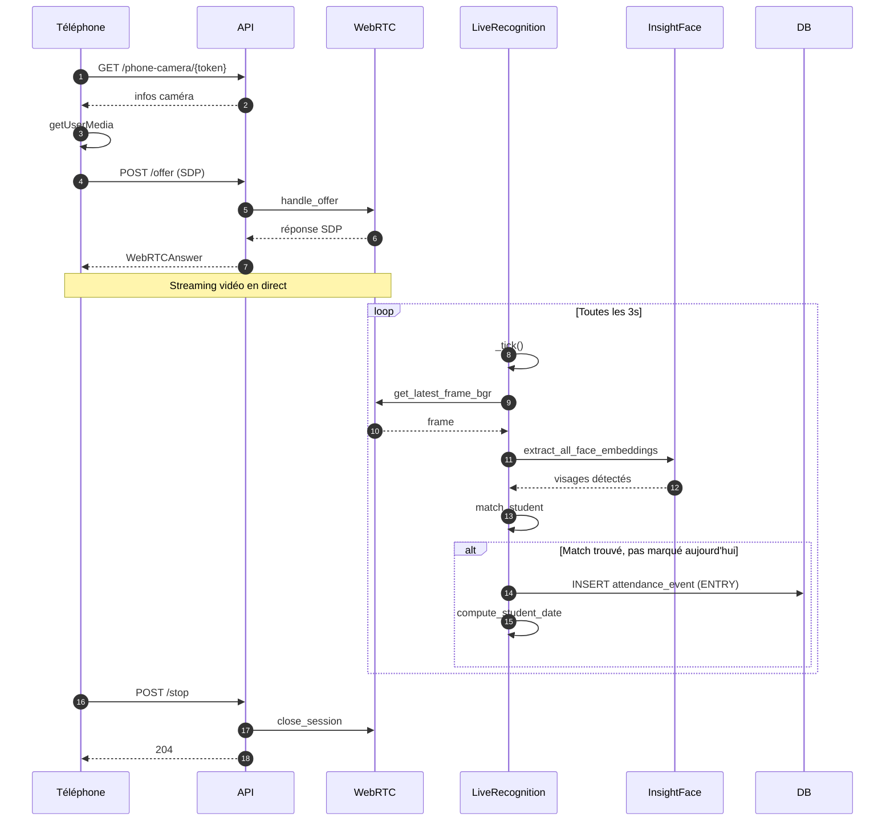
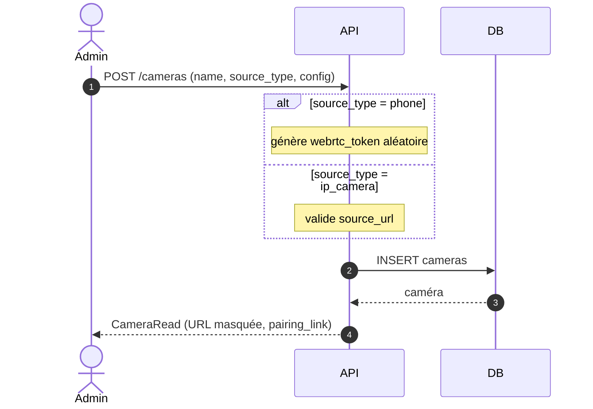
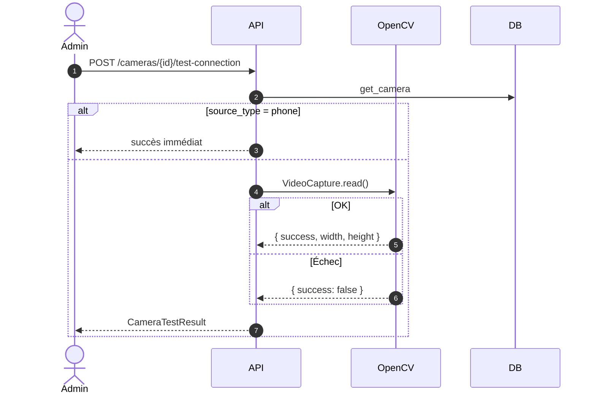
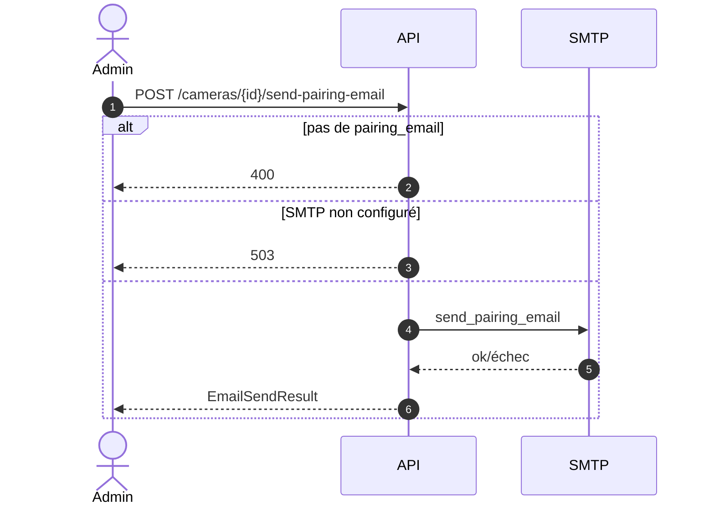
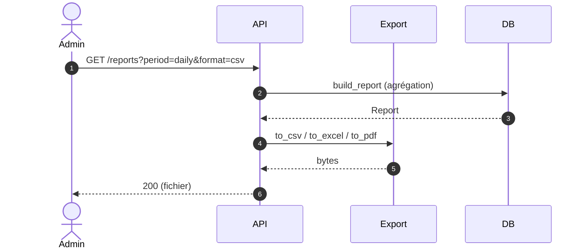
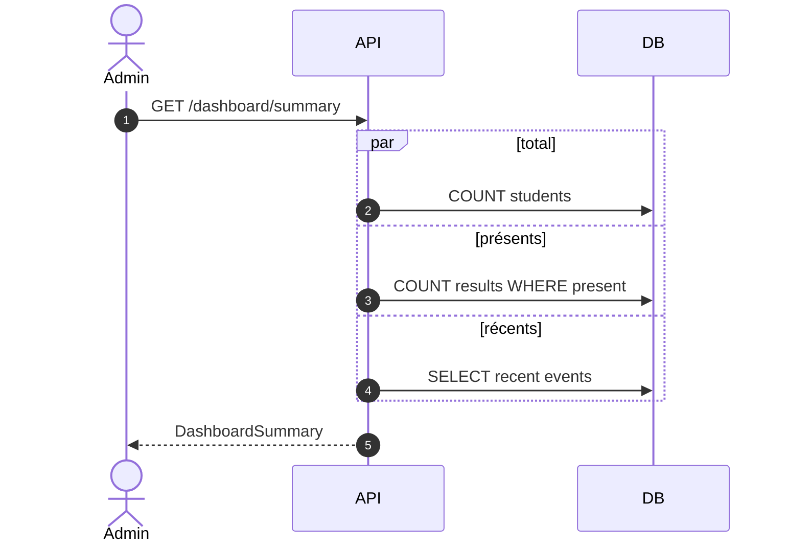

# Diagrammes de séquence (UML)

```mermaid
sequenceDiagram
    autonumber
    actor Client
    participant API as API
    participant CRUD as CRUD
    participant DB as DB

    Client->>API: POST /api/v1/auth/login (email, password)
    API->>CRUD: authenticate_user
    CRUD->>DB: SELECT users WHERE email
    DB-->>CRUD: utilisateur
    CRUD->>CRUD: verify_password (bcrypt)

    alt Échec
        API-->>Client: 401
    else Succès
        API->>API: create_access_token (JWT)
        API-->>Client: 200 Token
    end
```

---

```mermaid
sequenceDiagram
    autonumber
    actor Client
    participant API as API
    participant JWT as JWT
    participant CRUD as CRUD
    participant DB as DB

    Client->>API: POST /api/v1/students (Bearer, body)
    API->>JWT: get_current_user
    alt Jeton invalide
        API-->>Client: 401
    end
    API->>CRUD: get_student_by_matricule
    alt Matricule existe
        API-->>Client: 409
    else
        API->>CRUD: create_student
        CRUD->>DB: INSERT students
        API-->>Client: 201 StudentRead
    end
```

---

```mermaid
sequenceDiagram
    autonumber
    actor Admin
    participant API as API
    participant Photo as Photos
    participant Face as InsightFace
    participant DB as DB

    Admin->>API: POST /students/{id}/photo (image)
    API->>Photo: save_student_photo
    Photo-->>API: photo_path
    API->>Face: extract_single_face_embedding

    alt Aucun visage
        API-->>Admin: 422
    else Plusieurs visages
        API-->>Admin: 422
    else 1 visage
        API->>DB: UPDATE students SET photo, embedding
        API-->>Admin: 200 StudentRead
    end
```

---

```mermaid
sequenceDiagram
    autonumber
    actor Admin
    participant API as API
    participant Svc as Service
    participant Engine as Moteur
    participant DB as DB

    Admin->>API: POST /attendance/compute?date=...
    API->>Svc: compute_date

    loop Chaque étudiant
        Svc->>DB: get_events_for_student_on_date
        DB-->>Svc: événements bruts
        Svc->>Engine: build_intervals
        Engine-->>Svc: intervalles [entrée→sortie]

        loop Chaque séance
            Svc->>Engine: compute_session (ratio chevauchement)
            Engine-->>Svc: PRESENT/LATE/ABSENT
            Svc->>DB: upsert_result (idempotent)
        end
    end

    Svc-->>API: ComputeReport
    API-->>Admin: 200
```

---

```mermaid
sequenceDiagram
    autonumber
    participant Phone as Téléphone
    participant API as API
    participant WebRTC as WebRTC
    participant Live as LiveRecognition
    participant Face as InsightFace
    participant DB as DB

    Phone->>API: GET /phone-camera/{token}
    API-->>Phone: infos caméra

    Phone->>Phone: getUserMedia
    Phone->>API: POST /offer (SDP)
    API->>WebRTC: handle_offer
    WebRTC-->>API: réponse SDP
    API-->>Phone: WebRTCAnswer

    Note over Phone,WebRTC: Streaming vidéo en direct

    loop Toutes les 3s
        Live->>Live: _tick()
        Live->>WebRTC: get_latest_frame_bgr
        WebRTC-->>Live: frame
        Live->>Face: extract_all_face_embeddings
        Face-->>Live: visages détectés
        Live->>Live: match_student
        alt Match trouvé, pas marqué aujourd'hui
            Live->>DB: INSERT attendance_event (ENTRY)
            Live->>Live: compute_student_date
        end
    end

    Phone->>API: POST /stop
    API->>WebRTC: close_session
    API-->>Phone: 204
```

---

```mermaid
sequenceDiagram
    autonumber
    actor Admin
    participant API as API
    participant DB as DB

    Admin->>API: POST /cameras (name, source_type, config)
    alt source_type = phone
        Note over API: génère webrtc_token aléatoire
    else source_type = ip_camera
        Note over API: valide source_url
    end
    API->>DB: INSERT cameras
    DB-->>API: caméra
    API-->>Admin: CameraRead (URL masquée, pairing_link)
```

---

```mermaid
sequenceDiagram
    autonumber
    actor Admin
    participant API as API
    participant Svc as OpenCV
    participant DB as DB

    Admin->>API: POST /cameras/{id}/test-connection
    API->>DB: get_camera
    alt source_type = phone
        API-->>Admin: succès immédiat
    else
        API->>Svc: VideoCapture.read()
        alt OK
            Svc-->>API: { success, width, height }
        else Échec
            Svc-->>API: { success: false }
        end
        API-->>Admin: CameraTestResult
    end
```

---

```mermaid
sequenceDiagram
    autonumber
    actor Admin
    participant API as API
    participant SMTP as SMTP

    Admin->>API: POST /cameras/{id}/send-pairing-email
    alt pas de pairing_email
        API-->>Admin: 400
    else SMTP non configuré
        API-->>Admin: 503
    else
        API->>SMTP: send_pairing_email
        SMTP-->>API: ok/échec
        API-->>Admin: EmailSendResult
    end
```

---

```mermaid
sequenceDiagram
    autonumber
    actor Admin
    participant API as API
    participant Export as Export
    participant DB as DB

    Admin->>API: GET /reports?period=daily&format=csv
    API->>DB: build_report (agrégation)
    DB-->>API: Report
    API->>Export: to_csv / to_excel / to_pdf
    Export-->>API: bytes
    API-->>Admin: 200 (fichier)
```

---

```mermaid
sequenceDiagram
    autonumber
    actor Admin
    participant API as API
    participant DB as DB

    Admin->>API: GET /dashboard/summary
    par total
        API->>DB: COUNT students
    and présents
        API->>DB: COUNT results WHERE present
    and récents
        API->>DB: SELECT recent events
    end
    API-->>Admin: DashboardSummary
```
